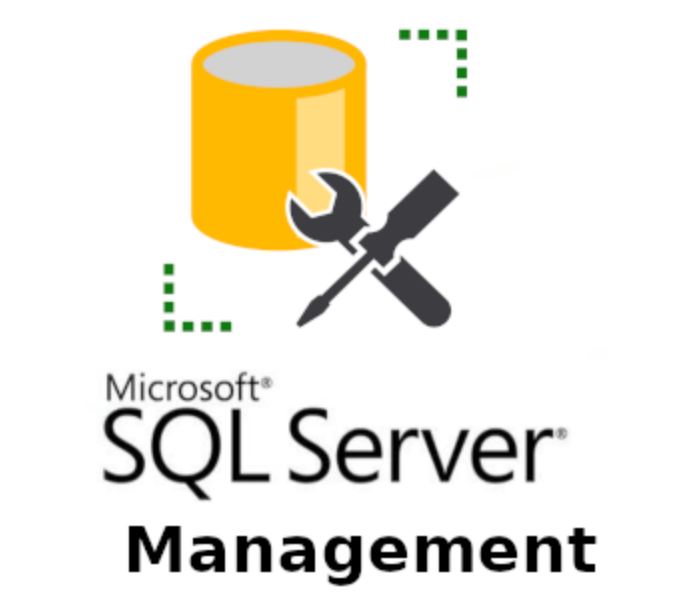

# Trabajando con Api de tickets
 
 
 
 
 

# Descripción del proyecto
En el proyecto, hemos trabajado con una api alojada en TeamSupport. En esta api, hemos trabajado concretamente con el apartado de tickets, en donde hemos accedido a su json para conocer la estructura de dicho apartado, para, posteriormente, crear una BD en Postgresql con dicha estructura, y añadir datos. Todo esto, como mencionamos posteriormente, para aprender a trabajar con diferentes estructuras de BD.

# Tecnologías utilizadas
En cuanto a las tecnologías utilizadas, tenemos a SQL Management Studio como base de datos de nuestra información, JavaScript como lenguaje principal en el que hemos trabajado, y Node como entorno de desarrollo. También hemos contado con ayuda del IDE VisualStudioCode.

# Utilidad
Con este proyecto, pretendemos aprender acerca del funcionamientop de una api y su estructura de tablas. Con este proyecto aprenderemos a realizar diferentes peticiones de nuestra api y extraer su información, manipulándola a nuestro antojo en diferentes formatos.

# Estructura de nuestro proyecto
- ## Api_tools
  ### Utilidades de nuestra app.

  - <strong> api_connection.js </strong> -> Conexión a nuestra api de tickets mediante endpoints, almacenando la información obtenida en formato json
  - <strong> FULL_INSERT </strong> -> Insercción automatizada de todos nuestros inserts
  - <strong> key_list_group.js, key_list_product.js, key_list_tickets.js y key_list_group.js </strong> -> Método que nos transforma los json de nuestras claves, en listas utilizables
  - <strong> swap_fecha.js </strong> -> Método conversor de formatos americano y español
  
- ## apiJSON
  ### Carpeta en donde alojaremos los datos extraídos de la api en formato json

- ## config
  ### Configuración básica de nuestra bd (datos dales como puerto, usuario, password...)

- ## db
  ### Carpeta principal de nustro proyecto, en donde se encuentran todos los archivos importantes para el arranque de nuestra app
  - inserts -> Carpeta en donde alojamos los inserts de los datos de la api a nuestras tablas físicas creadas en SQL Management Studio (también almacenamos aquí las claves.json de cada tabla)
  - migrations -> Migraciones de creación de tablas
  - models -> Modelos o esquemas de nuestras tablas
  - config.js -> Archivo de configuración de sql server (mssql)
  
